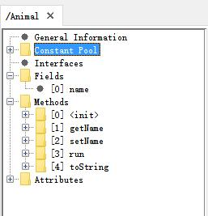
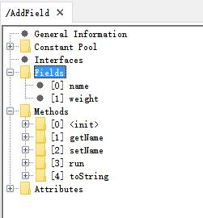
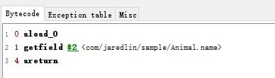
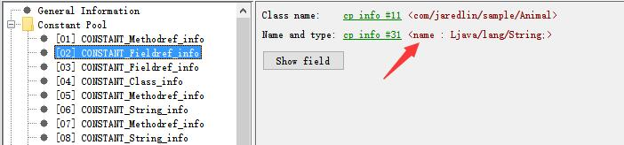
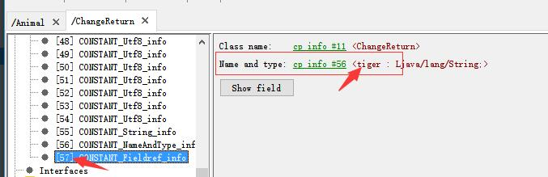

# 修改class文件 (一)

> com.jaredlin.sample.Animal.java

```java
public class Animal {
    private String name;

    public String getName() {
        return name;
    }

    public Animal setName(String name) {
        this.name = name;
        return this;
    }

    public void run() {
        System.out.println("My name is "+name+",I'm running");
    }

    @Override
    public String toString() {
        return this.name;
    }
}
```

## 使用jclasslib bytecode viewer 查看class文件



## addField

```java
public static void addField(){
    ClassPool pool = ClassPool.getDefault();
    try {
        CtClass ctClass = pool.get("com.jaredlin.sample.Animal");
        Utils.rename(ctClass,"AddField");
        Utils.addStringField(ctClass, "weight", "3kg");
        ctClass.writeFile();
    } catch (Exception e) {
        e.printStackTrace();
    }
}
```


## 修改getName返回结果为Tiger
修改前getName方法对应的java源码
```java
return name;
```

对应的Bytecode



其中 #2 表示获取到 Constant Pool 中的第二项 (Bytecode中的方法getfield必须获取的是CONSTANT_Fieldref_info) , 每行前面的红色数字表示当前这一行byte的起始位置 (后面修改的时候要用到 , 后面要修改的byte的index是3) .



为了使得getName方法的Bytecode改动量最小 , 需要新增一个field值为 "Tiger" 并直接替换为#2的位置 , 代码如下 (新增tiger , 查看ConstantPool确认tiger的序号 , 添加修改方法 ):

```java
public static void changeReturn() {
     ClassPool pool = ClassPool.getDefault();
     try {
         CtClass ctClass = pool.getAndRename("com.jaredlin.sample.Animal","ChangeReturn");
         Utils.addStringField(ctClass,"tiger","Tiger");

         //修改方法开始 (修改方法需要新增的field在ConstantPool中的序号后执行)
         CtMethod method = ctClass.getDeclaredMethod("getName");
         CodeAttribute codeAttribute = method.getMethodInfo().getCodeAttribute();
         CodeIterator iterator = codeAttribute.iterator();
         iterator.writeByte(57, 3);//tiger在ConstantPool中的序号
         //修改方法结束

         ctClass.writeFile();
     } catch (Exception e) {
         e.printStackTrace();
     }
 }
```


